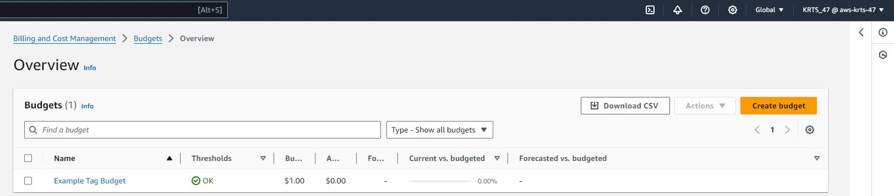

# Week 0 — Billing and Architecture

## Required Homework

### Install AWS CLI

## Homeworks Challenges

### Create a Billing alarm

### Create a budget
I created my own budget for 1 dollar.

### Recreate Logical Architecture Design

Lucid  Chards 

[Lucid Charts Share Link](https://lucid.app/lucidchart/bfd999bf-df64-4cbb-a233-8f167b56a6ea/edit?viewport_loc=-1553%2C-550%2C3576%2C3110%2C0_0&invitationId=inv_ac7c800d-03f0-4c66-a2e0-c402bcd74064)

## Example of referencing a file in the database
[week0/json/alarm-config.json](https://github.com/W47-KRTS/aws-bootcamp-cruddur-2023/blob/main/aws/json/alarm-config.json)
